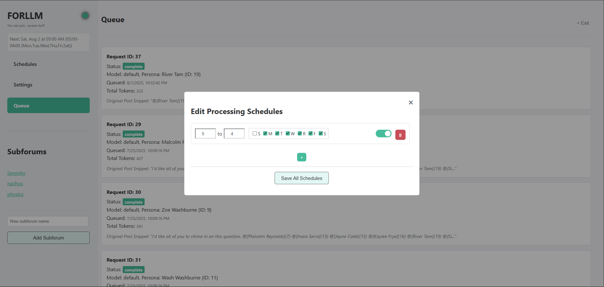
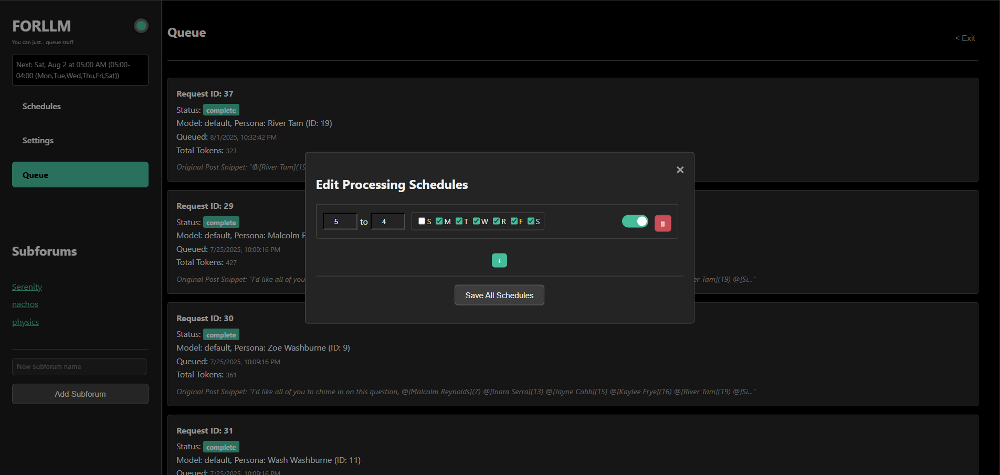

# FORLLM: A Forum for Local Language Models
**Version 0.1 Public Beta**

<!-- Optional: Add a logo here -->
<p align="center">

</p>

---

### FORLLM is a self-hosted, forum-style interface for your local LLMs that turns long inference waits into a seamless, asynchronous conversation. In public beta, adventerous users welcomed.

<p align="center">

</p>

## Introduction
FORLLM embraces running LLMs that are too big for your GPU. Since this takes so much longer, FORLLM embraces the queue. Run any inference while you're asleep or at work. And embrace the forum interface, live chat is a twerp.

Or to put it another way, with FORLLM, you can just queue stuff. I like to run models much bigger than my 1070 can handle, but Gemma 3 27b can take an hour and half per response that way. That's painful in a live chat interface and impairs an old PC's ability to do other things while you wait for a reply. Queuing leaves your PC available when you're around and lets your defer inference to when your PC would otherwise be idle. And the time makes sense in a forum context, where replies often come hours or days later.

## ✨ Key Features

*   **Asynchronous Processing:** Queue up LLM requests and let them process in the background without tying up the UI.
*   **Flexible Scheduler:** Define exactly when your LLM processor should be active to manage hardware resources effectively.
*   **Advanced Persona Management:** Create, edit, version, and assign detailed personas for your LLMs to adopt, giving you fine-grained control over response style and content.
*   **Dynamic Persona Generation:** Use an LLM to help you create new, creative personas automatically from simple descriptions or based on forum topics.
*   **Smart Chat Context:** Provides both direct conversation history and "ambient" context from other threads for more intelligent and context-aware replies.
*   **Live Theme Customization:** A built-in, interactive theme creator to tailor the look and feel in real-time.
*   **Tripane UI:** A responsive layout that allows you to view your main forum, a topic thread, and post details all on one screen for maximum productivity.
*   **Markdown Editor:** Write posts with rich formatting, syntax highlighting, and see token estimates before you send.
*   **Persona Tagging:** Mention personas with `@PersonaName` to bring them into a conversation, enabling multi-persona discussions.

## 🚀 Getting Started

### Prerequisites

*   Python 3.10-3.13 (let me know what python versions you get it running in and I'll expand this range)
*   Git
*   An active, running [Ollama](https://ollama.com/) instance.

### Installation & Launch

1.  **Clone the repository:**
    ```bash
    git clone https://github.com/boilthesea/forllm.git
    cd forllm
    ```

2.  **Create and activate a virtual environment (optional, skippable):**
    ```bash
    # For macOS/Linux
    python3 -m venv venv
    source venv/bin/activate

    # For Windows
    python -m venv venv
    venv\Scripts\activate
    ```

3.  **Install dependencies:**
    ```bash
    pip install -r requirements.txt
    ```

4.  **Run the application:**
    ```bash
    python forllm.py
    ```

5.  **Open FORLLM:**
    Open your web browser and navigate to `http://127.0.0.1:4773`.
    You can open FORLLM's interface on other machines on the same network and mobile by finding your host PC's IP and adding the 4773 port to that. How depends on your platform, perplexity et al can provide detailed instructions.

## 💻 Basic Usage

1.  **Create a Subforum:** From the main page, create a new subforum to house your topics.
2.  **Create a Topic:** Inside your subforum, create a new topic.
3.  **Write a Post:** Write your initial prompt or question.
4.  **Request a Response:** Click the "Request LLM Response" button. Your request will be added to the processing queue.
5.  **Set a Schedule:** Click the Schedule button on the left nav, set up a schedule for inference, overnight, for example.
6.  **View the Response:** Once the background processor completes the request, the LLM's reply will appear in the topic thread.
7.  **Help debug FORLLM:** If you run into bugs, please document your setup (python version, browser, os, etc), document your issue (what were you doing when the bug occurred), start forllm.py over again while passing the --debug argument and once you trigger the bug again, copy your terminal output and browser console and post them either at the [FORLLM github](https://github.com/boilthesea/forllm) or [r/FORLLM](https://www.reddit.com/r/FORLLM/).


## Core Concepts & Advanced Features

### Managing Personas
You can create a new persona in `Settings -> Persona Management`. Here you can define its name, custom instructions, and other characteristics. Assign a global default persona. Eventually, you'll be able to assign specific personas to different subforums to act as topic experts.

### Tagging & Conversations
You can bring any active persona into a conversation by mentioning them with `@PersonaName` in your post instead of requesting a reply. This will queue a request for that specific persona to respond to your post, or you can add tags to an LLM's reply, eventually allowing for dynamic, multi-persona discussions. Persona responses to other personas is experimental and will improve over time.

### Understanding the Scheduler
In the `Settings` modal, you can define blocks of time for each day of the week when the LLM processor is allowed to run. Set up as many blocks as you like, different ones for M-F, weekends, etc. This is useful for ensuring resource-intensive tasks only happen overnight or during off-hours.

## 🛠️ Technology Stack

*   **Backend:** Python, Flask
*   **Frontend:** Vanilla JavaScript, HTML, CSS
*   **Database:** SQLite
*   **LLM Integration:** Ollama (initially)
*   **UI Libraries:** EasyMDE, Tom Select

## 🗺️ Roadmap

This project is under active development. Future plans include:

*   [ ] Better Firefox support.
*   [ ] Tripane overhaul, there's much to do to fully realize the potential.
*   [ ] Improved persona generation (functions, but needs refining).
*   [ ] Queue improvements (to show non-post items like queued persona generation).
*   [ ] Notes section.
*   [ ] Alternate unthreaded (vbulletin style) view of posts.
*   [ ] Direct message/live chat option.
*   [ ] Support for more LLM backends (let me know what backends you want support for).
*   [ ] Automated inter-persona communication and debates.
*   [ ] LLM-powered topic summarization tools.
*   [ ] Enhanced UI for subforum expert persona generation.
*   [ ] Image generation, inline and persona avatars (let me know what diffusion backend you prefer).
*   [ ] 1001 other tweaks and fixes.


## 📜 License

You may freely use this software, all other rights reserved for now. I've been laser focused on functionality for months and I haven't explored licenses at all. Feel free to chime in on what license you'd like to see and why.