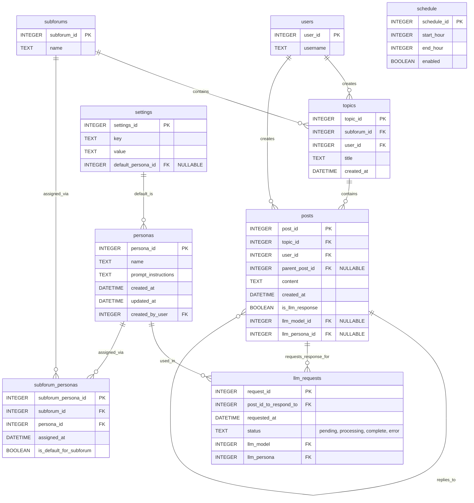

# Persona System Development Plan

## Objective

Implement a robust persona management system for FORLLM, enabling users to create, edit, delete, version, and assign multiple personas to subforums, set global and per-subforum defaults, and override persona selection at LLM request time. The system will be secure, performant, and extensible, with clear UI/UX and comprehensive API/test coverage.

## Plan

### 1. Database Schema Updates

- **Personas Table:**  
  Store persona details, including versioning and ownership fields (`created_at`, `updated_at`, `created_by_user`).
- **Subforum-Personas Linking Table:**  
  Many-to-many relationship between subforums and personas, supporting multiple personas per subforum, with a flag for the default persona per subforum. 
- **Settings Table:**  
  Store the global default persona ID for new subforums.
- **Indexing:**  
  Add indexes to optimize queries for persona assignment and lookup.

**ER Diagram:**

### 2. Backend Implementation (`forllm_server/`)

- **Database Logic:**  
  - Extend `database.py` for persona CRUD, versioning, and assignment logic.
  - Add validation for persona instructions to prevent malicious input.
  - Ensure fallback logic: if no persona is assigned to a subforum, use the global default or a built-in fallback persona.
- **API Endpoints:**  
  - In `routes/settings_routes.py`, provide endpoints for persona management (list, create, update, delete, get, version history), global default persona, and prompt preview.
  - In `routes/forum_routes.py`, endpoints for assigning/unassigning multiple personas per subforum, setting per-subforum default, and listing assigned personas.
  - In `routes/llm_routes.py`, allow persona override at LLM request time.
  - Ensure all endpoints return consistent, well-documented JSON responses with robust error handling.
- **LLM Request Logic:**  
  - On LLM request, determine persona:  
    1. Use persona specified by user (if provided and valid for subforum).  
    2. Else, use subforum default.  
    3. Else, use global default.  
    4. Else, use built-in fallback.
  - Fetch persona prompt instructions and incorporate into LLM prompt.
- **Testing:**  
  - Add unit and integration tests for persona assignment, fallback, and override logic.

### 3. Frontend Implementation (`static/js/` and `templates/`)

- **UI for Persona Management:**  
  - In `index.html`, add a "Personas" tab in settings.
  - In `static/js/personas.js`, implement persona CRUD, versioning display, assignment to subforums, and global default management.
  - Add prompt preview functionality so users can see how instructions will appear in the final prompt.
  - In `static/js/settings.js`, integrate persona management into settings navigation.
  - In `static/js/forum.js`, display all personas assigned to a subforum, indicate the default, and allow persona selection/override when requesting an LLM response.
- **Validation:**  
  - Validate persona instructions client-side before submission.
- **Styling:**  
  - Update CSS files to style new UI elements for persona management and selection.

### 4. Refinement & Advanced Features

- **Versioning/Audit Trail:**  
  - Track persona changes and display version history in the UI.
- **Persona Prompt Preview:**  
  - Allow users to preview the prompt as it will be sent to the LLM.
- **Fallback Logic:**  
  - Ensure graceful fallback to global or built-in persona if none is assigned.
- **Validation & Security:**  
  - Sanitize persona instructions and validate input both client- and server-side.
- **API Consistency:**  
  - Standardize all persona-related API responses and error formats.
- **Testing:**  
  - Comprehensive tests for persona assignment, override, and fallback.
- **Performance:**  
  - Index linking tables and optimize queries for fast persona lookup.
- **Multiple Personas per Subforum:**  
  - Support assigning multiple personas to each subforum from the start, with clear UI for selection and default indication.
- **Persona Override at LLM Request:**  
  - Allow users to select any persona assigned to the subforum (or global default) when making an LLM request.

---

**Questions for You:**
1. Should persona versioning include the ability to revert to previous versions, or just view history? Answer: Include ability to revert, good idea.
2. Should persona assignment to subforums be restricted by user permissions, or is everyone allowed to assign/unassign? Answer: There's currently only one user, no login, no permissions yet. So everyone is allowed, any restrictions will have to happen later when the user system is more feature rich.
3. Should the built-in fallback persona be editable, or is it hardcoded? Answer: Make it editable in settings.
4. Do you want audit logs for persona usage (e.g., which persona was used for each LLM request)? Answer: The queue page handled by llm_queue.py contains a history of requests and should show which persona will be (for incomplete requests) or was used (for complete requests).
5. Is there a maximum number of personas per subforum, or unlimited? Answer: Unlimited.

---

## Implementation Notes & Improvements (May 2025)

- Added a `persona_versions` table to support full versioning and revert capability for personas, as discussed in the Q&A.
- The `personas` table now includes `is_active` for soft-deletion and `version` for tracking current version.
- A built-in fallback persona is created by default (editable, persona_id=1).
- Indexes were added for fast lookup on persona assignment and active personas.
- The `settings` table is extended to include a `globalDefaultPersonaId` for new subforums and fallback logic.
- All schema changes are idempotent and backward compatible.
- Next steps: implement CRUD and assignment logic in the backend, then expose via API endpoints as per plan.

